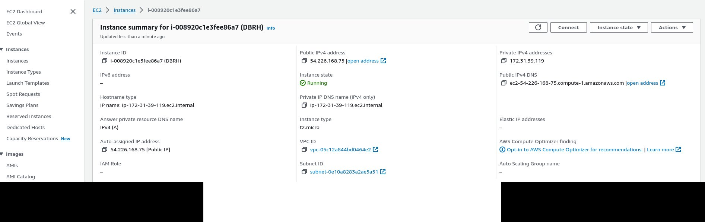
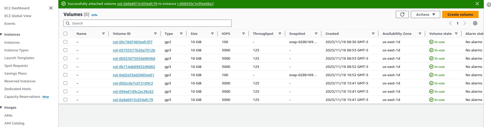
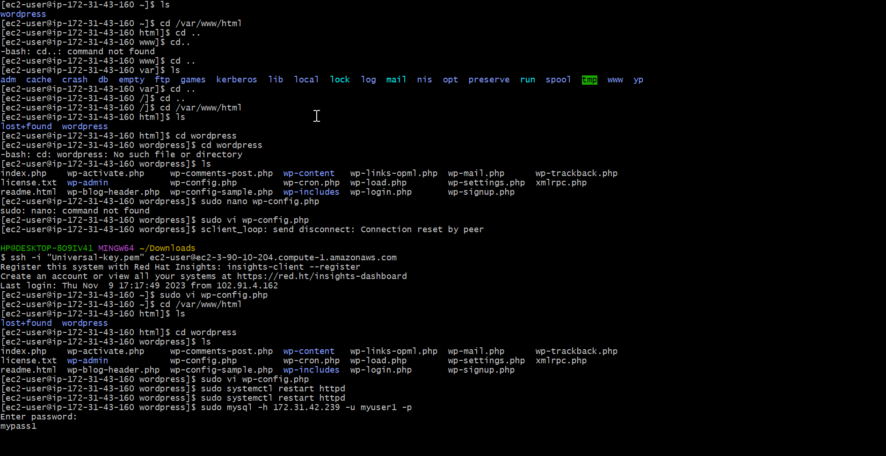
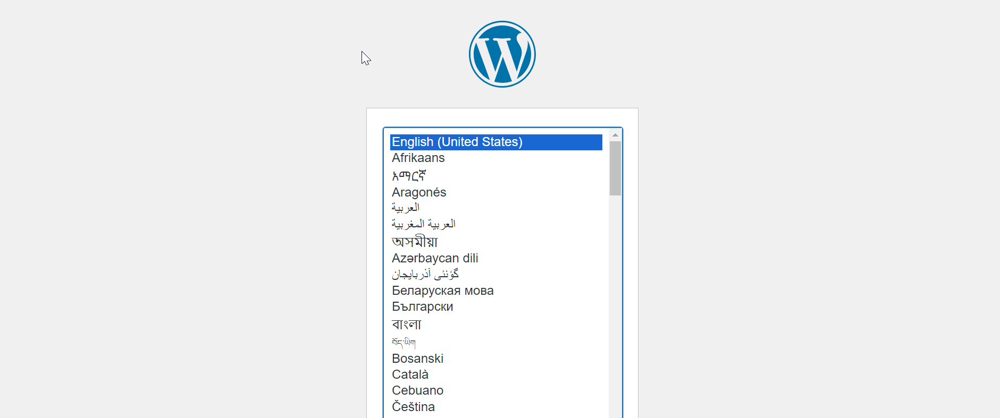
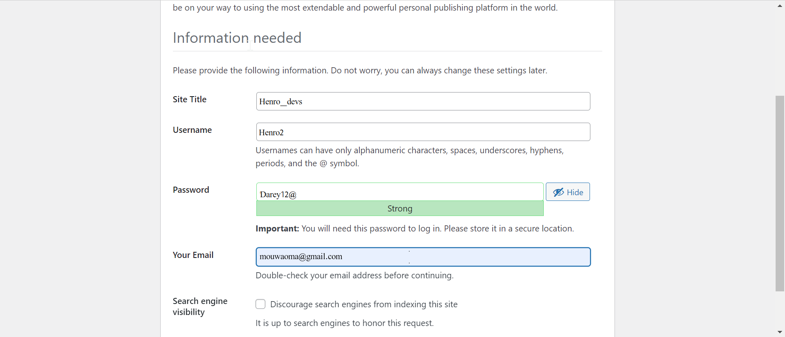
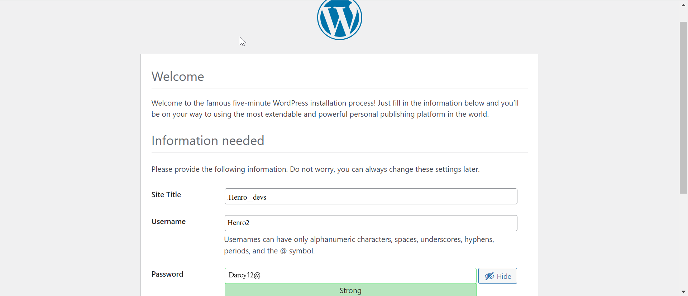
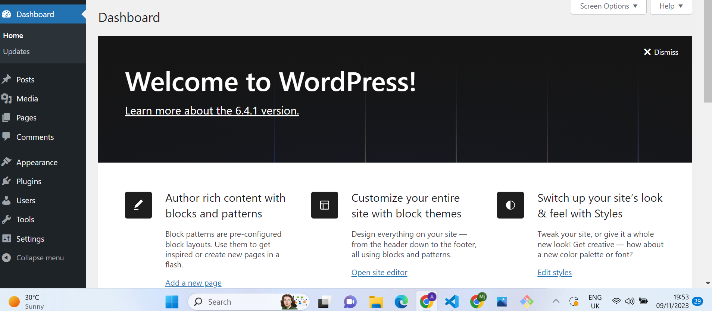

## IMPLIMENTING WORDPRESS WEBSITE USING LOGICAL VOLUME MANAGEMENT STORAGE

**STEP1** (Web server Preperation)

-  Spined up Ubuntu redhat instance in AWS called **ApacheServerRH**

   
- I created 3 volumes with 10gb each in the same availability zone and attached the volumes to my server. 

   

- With Termius cleint, I ssh into my server and updated it with **sudo yum update** 

    

- Using **lsblk**, I inspected the block divices i attached earlier and noted each name giving to them as xvdf,xvdg,xvdh

   

- I used **df -h** command to check all mounts and free space in my redhat server.

  

- Using **gdisk**, I created single partition on each of the 3 disks using the followind commands.
    sudo gdisk /dev/xvdf

    sudo gdisk /dev/xvdg

    sudo gdisk /dev/xvdh

    

- Using **lsblk**, command, I checked to see the newly configure partition in the 3 disks.

  

-  I installed lvm2 package using **sudo yum install lvm2**

    

- Using **pvcreate**, I marked the 3 disks as physical volumes to be used my the LVM

   sudo pvcreate /dev/xvdf

   sudo pvcreate /dev/xvdg1

    sudo pvcreate /dev/xvdh1

    

-  To varify that my physical volumes have been created successfully, I used **sudo pvs** command

   

-  I used vgcreate to add the 3 Physical volumes to a volume group and name it **webdata-vg**

   

- Using **sudo vgs**, I varified that my Volume group was created successfully 
 

 - Using lvcreate utility, i created 2 logical volumes by diving the disk into half and call it **apps-lv** and use the remaining space for **logs-lv**, with this command

 -  **sudo vgdisplay -v #view complete setup - VG, PV, and LV
sudo lsblk**

 
 
    **sudo lvcreate -n apps-lv -L 14G webdata-vg**

    **sudo lvcreate -n logs-lv -L 14G webdata-vg**

    

- I used sudo lvs to varify that my logical volumes was cteated successfully.

  

-  I used **sudo vgdisplay -v #view complete setup - VG, PV, and LV** to varify all my setup 
  

  -  Sudo **slblk** 

 

    
    

-  I used **sudo mkfs -t ext4 /dev/webdata-vg/apps-lv**

 
    **sudo mkfs -t ext4 /dev/webdata-vg/logs-lv**

    to format the logical volumes in **ext4**  format

   

-  I now created the directory to store my website files 

    **sudo mkdir -p /var/www/html**

- I also created a directory to store my logs 

    **sudo mkdir -p /home/recorvery/logs**

    

-  I mouted my file system and log using 

     **sudo mount /dev/webdata-vg/apps-lv /var/www/html/**

    **sudo mount /dev/webdata-vg/logs-lv /var/log**

  -  Using sudo blkid to get UUID to update /etc/fstab file 

     

       

     -  Sudo -a to mout it 

-    sudo **systemctl daemon-reload**,  to reolad .

-  df -h to varify that my setup is running 

   

   ## INSTALLING WORDPRESS AND CONFIGURING TO USE MYSQL DATABASE 

   Preparing the database Server

   - I  repeating the same step above, BUt instead of apps-lv create db-lv and mount it into directory /db instead of /var/www/html

   -  Launch an EC2 instance of redhat called DBRH

   -  

- I created and attach 3-volumes to the DB as shown bellow.

   

-    To see the newly created devices,  i Run **lsblk** command

   

-  I created a single partition on each of the 3 disks using 

    **Run sudo gdisk /dev/xvdf**

    **Run sudo gdisk /dev/xvdg**

    **Run sudo gdisk /dev/xvdh**

   

-  I installed the lvm2 package using

    **sudo yum install lvm2**

-  To mark each of the three disks as physical Volumes(Pvs) to be used by LVM, I used the following command

        sudo pvcreate /dev/xvdf1
        sudo pvcreate /dev/xvdg1
        sudo pvcreate /dev/xvdh1

-  I added all the three Physical volumes(Pvs) to a Volume Group(VG). and Nameedt he VG webdata-vg with the follwing command

    **sudo vgcreate webdata-vg /dev/xvdh1 /dev/xvdg1 /dev/xvdf1**

    

-  I created 2 logical volumes.db-lv with half of the pv size, and logs-lv Using the remaining space of the PV 

   **sudo lvcreate -n db-lv -L 14G webdata-vg**

    **sudo lvcreate -n logs-lv -L 14G webdata-vg**

    

-  o Formated the logical Volumes with ext4 file system using mkfs.ext4

    **sudo mkfs -t ext4 /dev/webdata-vg/db-lv**

    **sudo mkfs -t ext4 /dev/webdata-vg/logs-lv**

    

-  I created **/db** directory to store websites file with 

   **sudo mkdir -p /db** and also created  /home/recovery/logs to store back up of the logs data with **sudo mkdir -p /home/recovery/logs**

   

-  I mounted /db on db-lv logical volume using

    **sudo mount /dev/webdata-vg/db-lv /db**

    

-  I backed up files in the log directory /var/log into home/recovery/logs using the rsync utility

    **sudo rsync -av /var/log/. /home/recovery/logs/**

    

-  I mounted var/log on logs-lv logical volume using 

     **sudo mount /dev/webdata-vg/logs-lv /var/log**

  -  I restored log files back into /var/log directory

    sudo rsync -av /home/recovery/logs/log/. /var/log

-  to update /etc/fstab so that the mount configuration will persist after restart

    I use **sudo blkid**, and copy the UUID of the device to upate the /etc/fstab

   webdata--vg-logs--lv: UUID="1d5e62d5-b470-4f37-8798-154a5e502298"
   webdata--vg-db--lv: UUID="91917864-f132-4bdb-b6a9-48468ed73e4a"

    

-  To test the configuration and reload the Daemon

     **sudo mount -a and sudo systemctl daemon-reload**

     

-  To verify the set up is running well

    i run **df -h**

    

    ## Installing Wordpress to use MySQL Database

    STEP3

    I Updated the reprository using **sudo yum -y update**

    

  -  I installed Apache, wget and its dependencies using 
     
     sudo yum -y install wget httpd php php-mysqlnd php-fpm php-json

  

  -  I started apache server and also enabled it  using 

     **sudo systemctl start httpd**

     **sudo systemctl enable httpd**

     

-  I installed PHP and its dependencies using the commands bellow

   sudo yum install https://dl.fedoraproject.org/pub/epel/epel-release-latest-8.noarch.rpm

sudo yum install yum-utils http://rpms.remirepo.net/enterprise/remi-release-8.rpm

sudo yum module list php

sudo yum module reset php

sudo yum module enable php:remi-7.4

sudo yum install php php-opcache php-gd php-curl php-mysqlnd

sudo systemctl start php-fpm

sudo systemctl enable php-fpm

setsebool -P httpd_execmem 1

-  I restarted apache

    Run sudo systemctl start httpd
    Run sudo systemctl enable httpd

-  I downlaoded Wordpress and copy wordpress to var/www/html with the comabd bellow

 

-  I configured SElinux Policies, I ran this commands

   sudo chown -R apache:apache /var/www/html/wordpress
sudo chcon -t httpd_sys_rw_content_t /var/www/html/wordpress -R
sudo setsebool -P httpd_can_network_connect=1

-  ## Installing wordpress and cofiguring it to use MYSQL DATABASE

       sudo yum update
       sudo yum install mysql-server

-  I started and enable mysql server using 

    **sudo systemctl start mysqld**

    **sudo systemctl enable mysqld**

    

-  ## Configuring DataBase to work with Wordpress.

-  sudo mysql
CREATE DATABASE wordpress1;
CREATE USER `myuser`@`107.20.125.167` IDENTIFIED BY 'mypass';
GRANT ALL ON wordpress1.* TO 'myuser'@'107.20.125.167';
FLUSH PRIVILEGES;
SHOW DATABASES;
exit

- ## configure wordpress to connect to remote database

- i Opened MYSQL port 3306 on DB-server and access it only from web-servers IP address

-   I Installed MySQL client and test that i can connect from Web-server to DB-server using mysql-client

  sudo mysql -u myuser -p -h 172.31.39.119

  

- cd into `/var/www/html` directory and `ls`
- cd into `wordpress` and `ls`
    - Run `sudo vi wp-config.php` and edit 
    
    

    - Restart `mysql` on DB-server
    - Run `sudo systemctl restart mysqld`
    
    - T0 access wordpress from browser 
 
    - Run ``http://<web-server public-Ip address>/wordpress/``
       - Run `http://107.20.125.167/wordpress/`

 

## Project completed

   
   

 

   