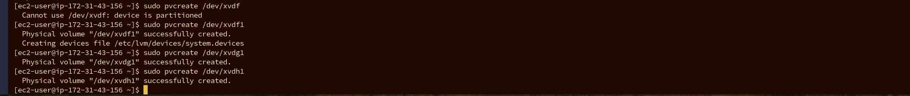

## IMPLIMENTING WORDPRESS WEBSITE USING LOGICAL VOLUME MANAGEMENT STORAGE

**STEP1** (Web server Preperation)

-  Spined up Ubuntu redhat instance in AWS called **ApacheServerRH**

   
- I created 3 volumes with 10gb each in the same availability zone and attached the volumes to my server. 

   

- With Termius cleint, I ssh into my server and updated it with **sudo yum update** 

    

- Using **lsblk**, I inspected the block divices i attached earlier and noted each name giving to them as xvdf,xvdg,xvdh

   

- I used **df -h** command to check all mounts and free space in my redhat server.

  

- Using **gdisk**, I created single partition on each of the 3 disks using the followind commands.
    sudo gdisk /dev/xvdf

    sudo gdisk /dev/xvdg

    sudo gdisk /dev/xvdh

    

- Using **lsblk**, command, I checked to see the newly configure partition in the 3 disks.

  

-  I installed lvm2 package using **sudo yum install lvm2**

    

- Using **pvcreate**, I marked the 3 disks as physical volumes to be used my the LVM

   sudo pvcreate /dev/xvdf

   sudo pvcreate /dev/xvdg1

    sudo pvcreate /dev/xvdh1

    

-  To varify that my physical volumes have been created successfully, I used **sudo pvs** command

   

-  I used vgcreate to add the 3 Physical volumes to a volume group and name it **webdata-vg**

   

- Using **sudo vgs**, I varified that my Volume group was created successfully 
 

 - Using lvcreate utility, i created 2 logical volumes by diving the disk into half and call it **apps-lv** and use the remaining space for **logs-lv**, with this command

 -  **sudo vgdisplay -v #view complete setup - VG, PV, and LV
sudo lsblk**

 
 
    **sudo lvcreate -n apps-lv -L 14G webdata-vg**

    **sudo lvcreate -n logs-lv -L 14G webdata-vg**

    

- I used sudo lvs to varify that my logical volumes was cteated successfully.

  

-  I used **sudo vgdisplay -v #view complete setup - VG, PV, and LV** to varify all my setup 
  

  -  Sudo **slblk** 

 

    
    

-  I used **sudo mkfs -t ext4 /dev/webdata-vg/apps-lv**

 
    **sudo mkfs -t ext4 /dev/webdata-vg/logs-lv**

    to format the logical volumes in **ext4**  format

   

-  I now created the directory to store my website files 

    **sudo mkdir -p /var/www/html**

- I also created a directory to store my logs 

    **sudo mkdir -p /home/recorvery/logs**

    

-  I mouted my file system and log using 

     **sudo mount /dev/webdata-vg/apps-lv /var/www/html/**

    **sudo mount /dev/webdata-vg/logs-lv /var/log**

  -  Using sudo blkid to get UUID to update /etc/fstab file 

     

       

     -  Sudo -a to mout it 

-    sudo **systemctl daemon-reload**,  to reolad .

-  df -h to varify that my setup is running 

   

   ## INSTALLING WORDPRESS AND CONFIGURING TO USE MYSQL DATABASE 

   

   
   

 

   